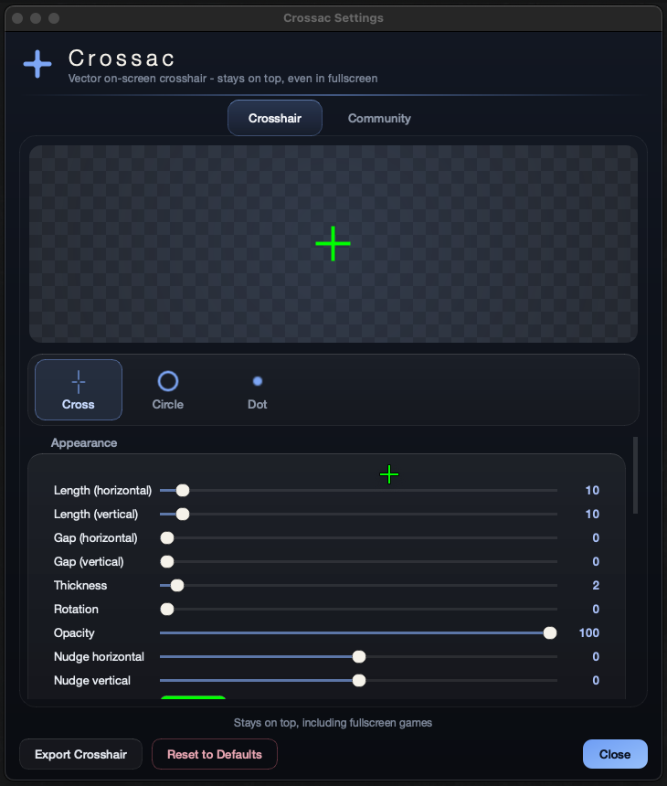

# crossac

A lightweight, cross-platform on-screen crosshair overlay. Vector-rendered, fully customisable, and always on top — even over fullscreen games.



| Windows | macOS | Linux (X11) |
| :-----: | :---: | :---------: |
| 🟨 |🟩 | 🟩 |

> **macOS / Windows:** the overlay is raised to the highest native window level
> and marked click-through, so it floats above fullscreen (borderless) games.

> **Linux:** relies on `_NET_WM_STATE_ABOVE` (X11). Wayland compositors usually
> forbid unmanaged overlays, so results may vary there.

## Features

- **Vector rendering** — crosshairs are drawn at runtime, not shipped as images.
  Crisp at any resolution and DPI. No bloat.
- **3 built-in styles** — Cross, Circle, Dot.
- **Shape parameters build the rest** — hide the top arm of the cross and it
  becomes a T; set 4 corners + 45° on the circle and you get a diamond; 3
  corners is a triangle, 64 is a round ring.
- **Deep customisation** — independent horizontal/vertical length and gap,
  thickness, opacity, rotation, nudge offset, colour, line caps, optional
  outline (colour + width), independent reticle dot (size + colour).
- **Live preview** — every change is applied instantly to both the preview and
  the on-screen crosshair.
- **Community library** — crosshairs are shared as JSON. On every launch crossac
  automatically pulls new crosshairs from the
  [community repo](https://github.com/ufuayk/crossac-repo). For now it is empty;
  it will grow as users contribute.
- **Export / Import** — export your design as a `.json` file and share it, or
  import files others share.
- **Multi-monitor** — pick which display the crosshair sits on.
- **Always on top + click-through** — guaranteed on Windows and macOS, works on
  X11.
- **System tray** — quick access to settings and quit.
- **i18n** — English, Türkçe, Español, Français. Adding a language = drop one JSON file.

## Requirements

- Python 3.9+
- PySide6 (`pip install PySide6`)

## Installation & Run

### macOS / Linux — quick install (recommended)

This installs crossac into an isolated virtual environment (your system Python
is never touched), generates an app icon, and adds a proper app entry —
`Crossac.app` in `~/Applications` on macOS, or a menu entry on Linux.

```bash
curl -fsSL https://raw.githubusercontent.com/ufuayk/crossac/main/install.sh | bash
```

To uninstall:

```bash
curl -fsSL https://raw.githubusercontent.com/ufuayk/crossac/main/uninstall.sh | bash
```

### Manual install (all platforms)

```bash
python3 -m venv .venv
source .venv/bin/activate       # Windows: .venv\Scripts\activate
pip install -r requirements.txt
python3 main.py
```

Exit via the tray icon menu.

## Adding a Language

Translations live in [`translations/`](translations). To add a new language,
create `translations/xx.json` with this shape — it will automatically show up
in the language dropdown:

```json
{
  "locale": "xx",
  "name": "Language Name",
  "translations": {
    "tray.settings": "Settings",
    "...": "..."
  }
}
```

Missing keys fall back to English automatically, so partial translations are
fine.

## Sharing a Crosshair

1. Design your crosshair in the settings window.
2. Click **Export Crosshair** — this writes a `.json` file.
3. Open a pull request on [`ufuayk/crossac-repo`](https://github.com/ufuayk/crossac-repo)
   adding your file to `crosshairs/` and a matching entry in `index.json`.
4. After approval, every crossac user gets your crosshair on their next launch.

The exported file is plain data (numbers + colours); crossac validates and
sanitises everything it downloads, and nothing from the community repo is ever
executed.

## Project Layout

```
main.py                 entry point
app/
  config.py             settings model + QSettings persistence
  renderer.py           vector crosshair renderer (6 styles)
  overlay.py            always-on-top overlay window
  native.py             Windows / macOS / Linux window hardening
  settings_dialog.py    settings UI (tabs, live preview, community)
  community.py          community fetch / validate / export / import
  tray.py               system tray
  theme.py              dark theme stylesheet
  i18n.py               translation engine
translations/           en.json, tr.json, es.json (drop more here)
```

## Disclaimer

- The user is responsible for all consequences of using the program.
- The program can be treated as a ban reason in certain games; the author is
  not responsible. Usage is entirely at the user's own risk.
- We do not recommend using the program in competitive games.

## License

[](https://www.gnu.org/licenses/gpl-3.0.html)
